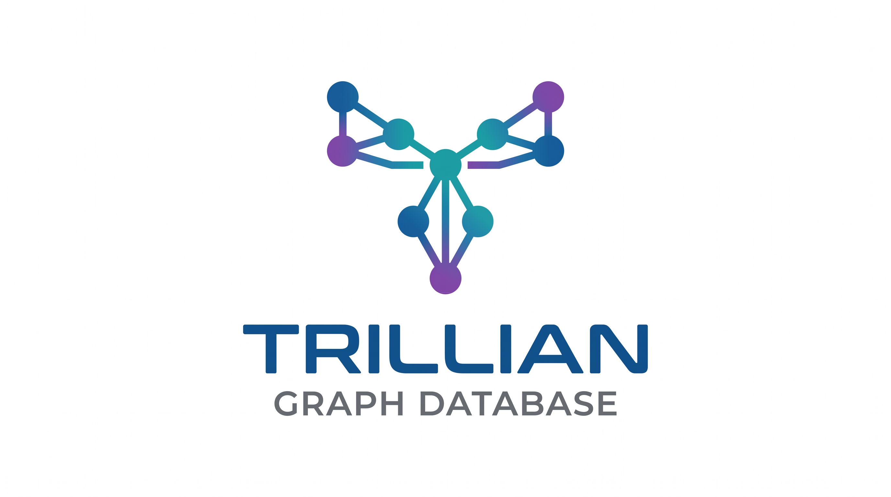

<p align="center">
  
</p>

# Trillian

<p align="center">
  <a href="https://github.com/42-grad/trillian/actions/workflows/rust.yml"></a>
  <a href="LICENSE"></a>
  
</p>

A lean, fast RDF triple store and SPARQL engine written in Rust. Trillian keeps
the whole graph in memory with flat, cache-friendly indexes and `u32` term IDs,
serves SPARQL over HTTP, and persists to a zero-copy memory-mapped snapshot. The
name is a nod to *The Hitchhiker's Guide to the Galaxy* — and to triple/trillion
scale.

It is built and maintained by [42grad GmbH](https://42-grad.com) as a building
block for retrieval-augmented and matching workloads, and released as a
contribution to open, sovereign, and sustainable data infrastructure.

## Highlights

- **In-memory, cache-friendly.** Three CSR permutation indexes (SPO/POS/OSP),
  `u32` IDs, no pointer chasing.
- **Hybrid query engine.** Worst-case-optimal joins (leapfrog triejoin) for
  cyclic patterns; a pipelined, cost-based plan for the rest.
- **Compact.** On the full WDBench Wikidata graph (1.26 billion triples) it
  holds the entire dataset resident in ~44 GB RAM (~35 bytes/triple) with a
  ~49 GB on-disk snapshot.
- **Fast.** Sub-millisecond entity lookups; single-pattern WDBench queries
  answer in ~1 ms median.
- **Durable updates.** `INSERT DATA`/`DELETE DATA` via a write-ahead log.
- **RDFS inference.** Backward-chaining query rewriter — no index changes,
  purely at query time. Enable with `?infer=rdfs`.
- **No cluster, no full ACID.** Trillian is deliberately a single-node,
  read-optimized triple store. Distributed consensus, distributed transactions,
  and heavyweight locking are traded away for simplicity and maximum query
  throughput. The `RwLock` + WAL pattern is sufficient for the typical
  read-many-write-rarely workload.

## Supported SPARQL

- `SELECT` and `ASK`; projection, `DISTINCT`, `LIMIT`, `OFFSET`
- Basic graph patterns, `OPTIONAL` (left joins), `UNION`
- `FILTER` — 3-valued logic: comparisons, `&&`/`||`/`!`, `BOUND`, arithmetic,
  `IN`, `IF`, and `STR`/`LANG`/`DATATYPE`/`STRLEN`/`U`-`LCASE`/`CONTAINS`/
  `STRSTARTS`/`STRENDS`/`isIRI`/`isLiteral`/`isNumeric`/`isBlank`
- `ORDER BY` (type-aware: numeric before lexical), with `LIMIT`/`DISTINCT`
- `BIND`
- `GROUP BY` with `HAVING` and the `COUNT`, `MIN`, `MAX`, `SAMPLE` aggregates,
  each accepting `DISTINCT`. Aggregate arguments must be a bare variable —
  `MIN(?v)`, not `MIN(?v + 1)`. `MIN`/`MAX`/`SAMPLE` hand back the stored
  term, so the result keeps its original datatype
- **Property paths**: `/ ^ | * + ?` and negated property sets
- IRIs, typed/`@lang` literals, blank nodes; `INSERT DATA`/`DELETE DATA`

Not yet supported (but planned): the `SUM`, `AVG` and `GROUP_CONCAT`
aggregates, sub-`SELECT`, `REGEX`.

### Inference (RDFS backward chaining)

All `/sparql`, `/stream`, and `/count` endpoints accept an optional `infer=rdfs`
parameter. When set, the query is rewritten at parse time to infer triples
reachable through RDFS rules:

| Rule | Effect |
|------|--------|
| `rdfs:subClassOf` | `?x a :C` also matches `?x a :D` when `:D subClassOf :C` |
| `rdfs:subPropertyOf` | `?x :p ?y` also matches `?x :q ?y` when `:q subPropertyOf :p` |
| `rdfs:domain` | `?x a :C` triggers `?x :p ?y` where `:p domain :C` |
| `rdfs:range` | `?x a :C` triggers `?y :p ?x` where `:p range :C` |

```bash
curl -G 'http://localhost:9090/sparql' \
  --data-urlencode 'query=SELECT ?s WHERE { ?s rdf:type ex:Animal }' \
  --data-urlencode 'infer=rdfs'
```

## Quickstart

```bash
cargo build --release --bin server     # builds the `server` binary
cargo test                             # runs the suite

# Build an index from N-Triples, persist it, then serve it:
./target/release/server build data.nt /tmp/data.bin
./target/release/server load  /tmp/data.bin 9090
```

Query it:

```bash
curl -G 'http://localhost:9090/sparql' \
  --data-urlencode 'query=SELECT ?s ?o WHERE { ?s <http://example.org/knows> ?o } LIMIT 10' \
  -H 'Accept: application/sparql-results+json'
```

### Endpoints

| Endpoint | Method | Description |
| --- | --- | --- |
| `/sparql` | GET/POST | SPARQL 1.1 JSON results |
| `/stream` | GET/POST | NDJSON stream: header line + one binding per line |
| `/count`  | GET/POST | Result count for a SELECT/ASK |
| `/update` | POST    | `INSERT DATA` / `DELETE DATA` |

All query endpoints support an optional `infer=rdfs` query parameter that enables
RDFS backward-chaining inference (subclass, subproperty, domain, range). Example:

```bash
curl -G 'http://localhost:9090/sparql' \
  --data-urlencode 'query=SELECT ?s WHERE { ?s rdf:type ex:Animal }' \
  --data-urlencode 'infer=rdfs'
```

## Example: GraphRAG with Mistral AI

[`examples/graphrag/`](examples/graphrag/) is a runnable tutorial that uses
Trillian for the *retrieval* in a GraphRAG pipeline — SPARQL fetches a connected,
multi-hop subgraph, which then grounds an answer generated by Mistral AI. The
retrieval step runs with just the Python standard library (no API key).

## Benchmarks

Trillian is measured against the published [WDBench](https://github.com/MillenniumDB/WDBench)
result numbers for Blazegraph, Jena, Virtuoso, and Neo4j on the full
1.26-billion-triple Wikidata graph. The reproducible harness lives in
[`infra/aws/`](infra/aws/) and [`benchmarks/`](benchmarks/); methodology and the
reference numbers are in
[`benchmarks/wdbench_reference.md`](benchmarks/wdbench_reference.md) and
[`BENCHMARKS.md`](BENCHMARKS.md).

> Caveat: different hardware and setup than the published runs, so absolute
> milliseconds are indicative, not a controlled head-to-head. Disk/store sizes
> are directly comparable.

## Architecture

See [ARCHITECTURE.md](ARCHITECTURE.md) for the storage layout (flat-CSR
permutations, dual-mode mmap dictionary), the hybrid query engine, and the
snapshot/WAL persistence model.

Background reading on the join algorithms:

- T. L. Veldhuizen, *Leapfrog Triejoin: A Simple, Worst-Case Optimal Join
  Algorithm* (ICDT 2014).
- H. Q. Ngo, E. Porat, C. Ré, A. Rudra, *Worst-case Optimal Join Algorithms*
  (PODS 2012 / JACM 2018).
- R. Angles et al., *WDBench: A Wikidata Graph Query Benchmark* (ISWC 2022).

## Contributing & security

PRs are welcome — the maintainers review and decide what merges (see
[CONTRIBUTING.md](CONTRIBUTING.md), DCO sign-off). Report vulnerabilities
privately per [SECURITY.md](SECURITY.md).

## License

Licensed under the [Apache License 2.0](LICENSE). Copyright © 2026 42grad GmbH.
